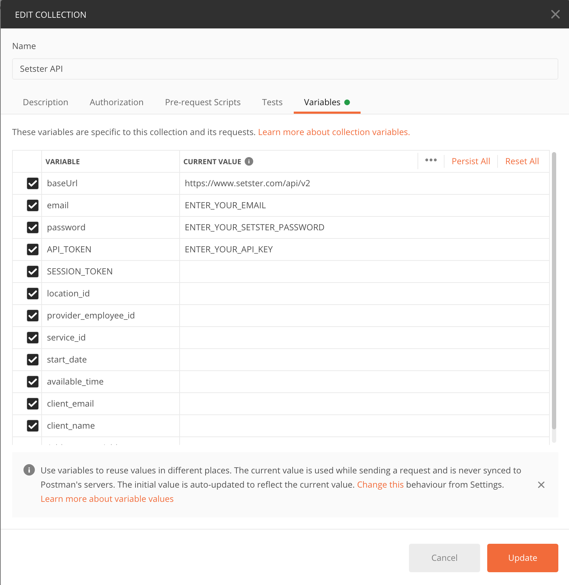

In this guide we'll be using a Postman Collection to test out sending requests to the Setster API with a final goal of creating a new appointment.

Download the Postman collection to follow along with the workflow for creating an appointment with the Setster API.

<a class="btn btn-danger" role="button" href="./Setster API.postman_collection.json"
   download="proposed_file_name">
<button name="button" style="position: relative;
  z-index: 3;
  overflow: hidden;
  padding: 15px 30px;
  border-radius: 0px;
  background-color: #07183b;
  font-family: Lato, sans-serif;
  color: #fff;
  font-size: 12px;
  font-weight: 500;
  letter-spacing: 2px;
  text-decoration: none;
  text-transform: uppercase; margin: 2px;">Download Postman Collection
</button></a>

#### Collection Variables
In this collection we'll be making use of [Collection Variables](https://learning.postman.com/docs/sending-requests/variables/#defining-collection-variables) to store data that we retrieve from a sequence of requests. To access and edit these variables edit the collection details and navigate to the variables section.

## Step 1
Authenticate your key to get your session token