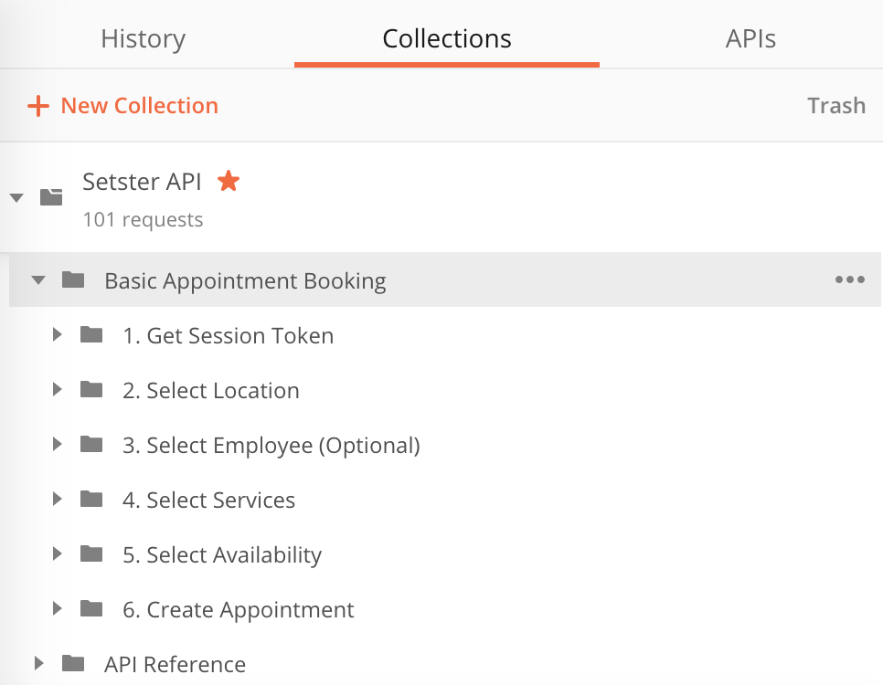
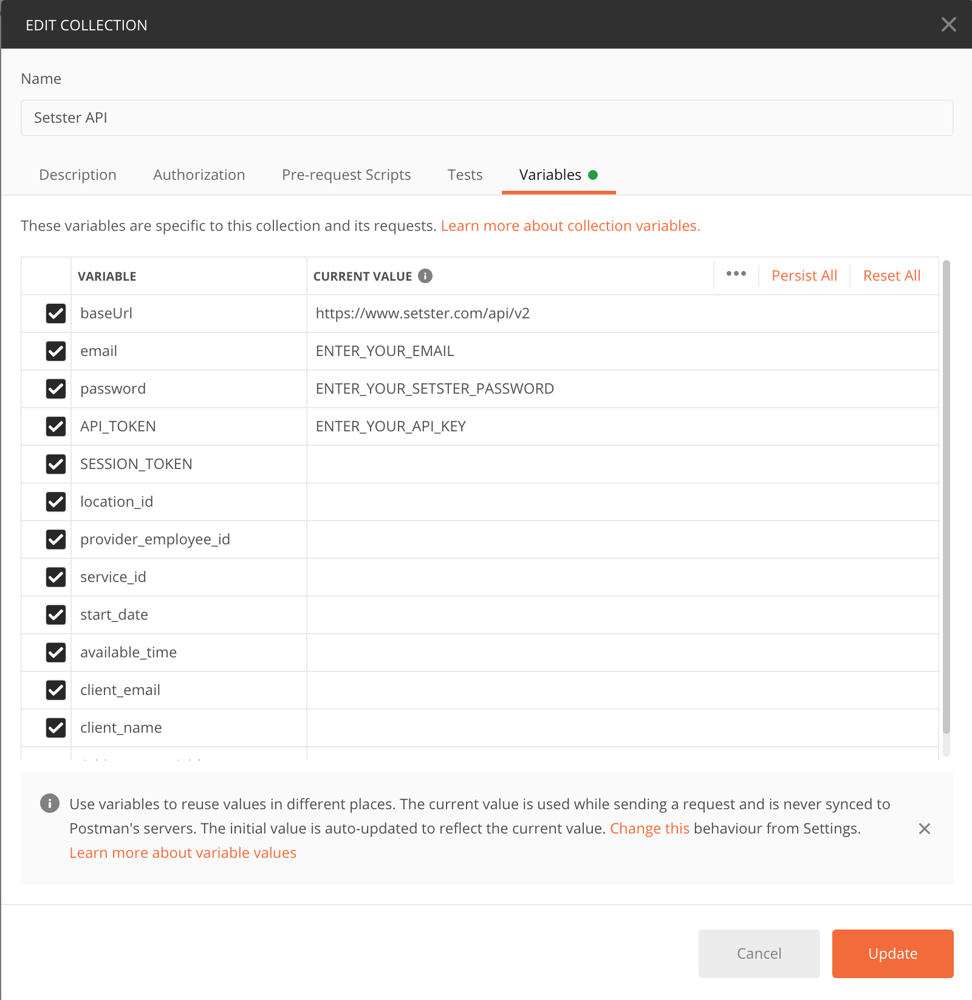

Setster’s scheduling platform employs a RESTful API that is easily deployed, secure and highly scalable to meet enterprise needs.

You can schedule thousands of appointments, remotely manage all of their parameters, track all user activity and plug Setster within your business workflow. In layman terms, with Setster, you can add massive scheduling capacity anywhere within your enterprise.

# Create Account
The first step to getting started using Setster to solve your complex scheduling needs is to create an account. The intuitive onboarding will walk you through adding all of the details about your business, locations, services, and staff that are a core component of developing your custom scheduling experience.

<button name="button" onclick="window.location.href='https://www.setster.com/onboarding/personal'" class="setster-btn">Sign Up</button>

# API Key

In order to use the Setster API you will need the API key that you can find within your Setster account. The Setster API works on HTTPS only. 

    
  
      <i class="info icon"></i>
      

        Never expose your API key in any public website's client-side code.
      

  

 
 

# Postman Collection

In this guide we'll be using a Postman Collection to test out sending requests to the Setster API with a final goal of creating a new appointment.

Download the Postman collection to follow along with the workflow for creating an appointment with the Setster API.

<a class="btn btn-danger" role="button" href="./Setster API.Basic_Booking_Reference.json"
   download="proposed_file_name">
<button name="button" class="setster-btn">Download Postman Collection
</button></a>

## Import Collection
To use the provided Postman Collection you'll need to import it into your workspace. Detailed instructions on importing collections can be found at the offical [Postman docs here](https://learning.postman.com/docs/getting-started/importing-and-exporting-data/).

## Structure
For the purpose of this getting started guide we'll be working within the <mark>Basic Appointment Booking</mark> folder.

## Collection Variables
In this collection we'll be making use of [Collection Variables](https://learning.postman.com/docs/sending-requests/variables/#defining-collection-variables) to store data that we retrieve from a sequence of requests. To access and edit these variables edit the collection details and navigate to the variables section.

<blockquote>
  Only the SESSION_TOKEN variable will be automatically populated after authentication. All other variables must be filled out manually.
</blockquote>

## Authenticate
Authenticate your key to get your session token. We'll use the session_token property from this response to send to all future requests.
 
If you're using the provided [Postman Collection](#section/Postman-Collection) locate the <mark>1. Get Session Token</mark> folder within the collection and open the POST request. Before making your first request you'll need to update the [collection variables](#section/Postman-Collection/Collection-Variables): `email, password, and API_TOKEN`. <blockquote>The `SESSION_TOKEN` and `company_id` collection variables will be automatically updated and saved in your collection after making the Authentication request to retrieve your session token. </blockquote>