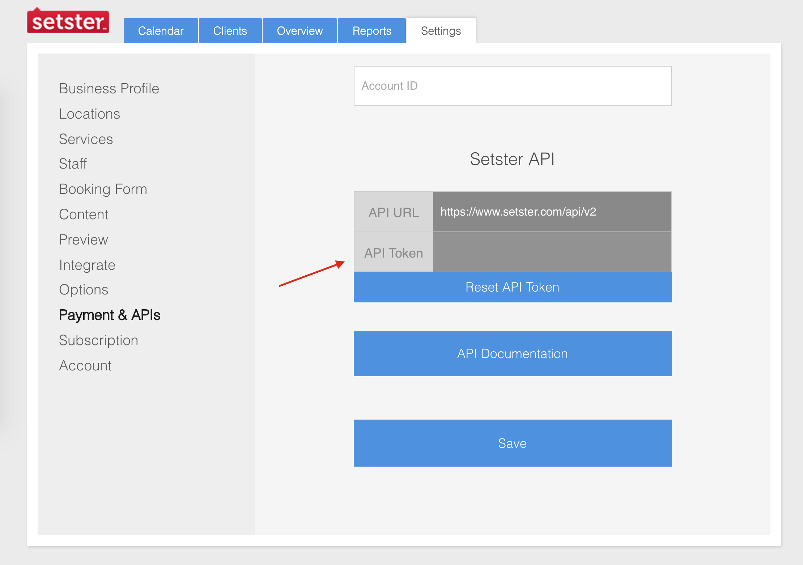

In order to use the Setster API you will need the API key that you can find within your Setster account. The Setster API works on HTTPS only. 

    
  
      <i class="info icon"></i>
      

        Never expose your API key in any public website's client-side code.
      

  

 
 
</img>