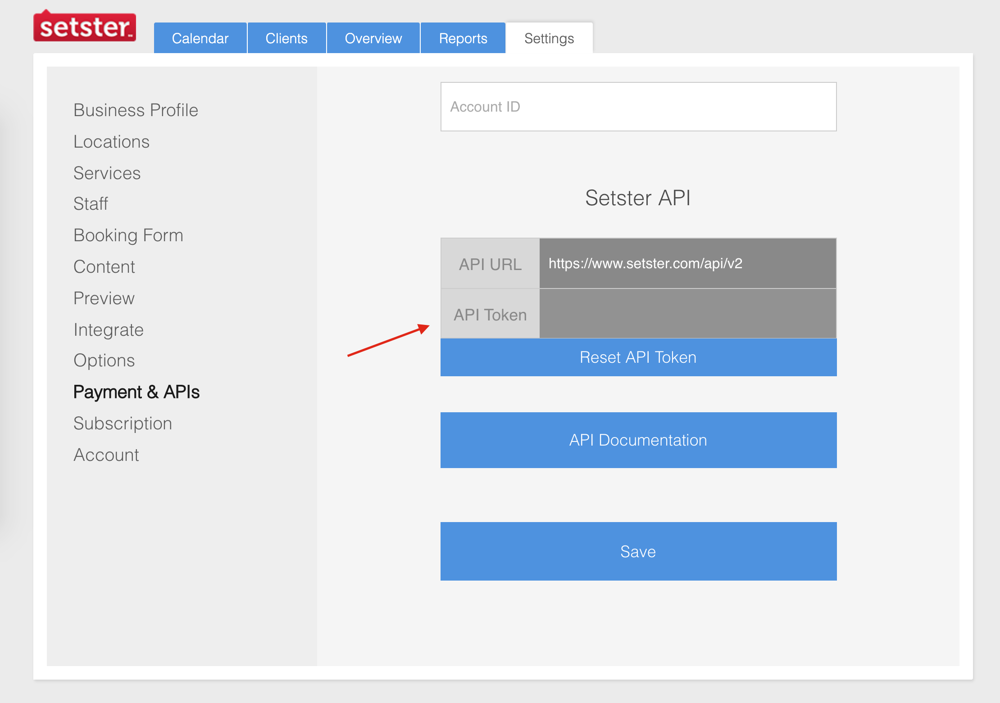

import {
  JsonSchema
} from '@redocly/ui';


The Setster API is used to control your account’s data programmatically. The API is organized around REST and standard HTTP verbs. A consistent envelope is used for all responses alongside response codes to indicate the status of the message and any error codes. JSON is returned on all our API responses with a consistent structure for all messages.

In order to use the Setster API you will need the API key that you can find within your Setster account and note you should never expose your API key in any public website's client-side code. The Setster API works on HTTPS only.

```
<RedocResponse pointer={"#/components/responses/ValidationError"} />
```
# Authentication


```
<!-- ReDoc-Inject: <security-definitions> -->
```

## Test
This is a test

```
<SchemaDefinition schemaRef="#/paths/~1account~1authenticate" />

<Schema schema="#/paths/~1account~1authenticate" />
```


## Nice
Cool Stuff

# Json Schema

Testing JSON schema 
```
<JsonSchema definitionId="setster" pointer="#/components/schemas/TilesSteps"	/>
```

## Very cool
nice

```
<SchemaDefinition schemaRef="#/tags/Account" />
```

<SchemaDefinition schemaRef="#/paths" />


*********

import { ButtonDark} from '../src/components/button.js'
import {MDXProvider} from '@mdx-js/react'


Setster’s scheduling platform employs a RESTful API that is easily deployed, secure and highly scalable to meet enterprise needs.

You can schedule thousands of appointments, remotely manage all of their parameters, track all user activity and plug Setster within your business workflow. In layman terms, with Setster, you can add massive scheduling capacity anywhere within your enterprise.


# Create Account
The first step to getting started with Setster is to create an account. The intuitive onboarding will walk you through adding all of the details about your business, locations, services, and staff that are a core component of developing your custom scheduling experience.

<MDXProvider>
  <ButtonDark link="https://www.setster.com/onboarding/personal" text="Sign Up"/>
  </MDXProvider>


  ```
  "info": {
    "version": "2.0",
    "title": "Setster Scheduling API",
    "description": "The Setster API is used to control your account’s data programmatically. The API is organized around REST  and standard HTTP verbs. A consistent envelope is used for all responses alongside response codes to indicate the status of the message and any error codes. JSON is returned on all our API responses with a consistent structure for all messages.\n\nIn order to use the Setster API you will need the API key that you can find within your Setster account and note you should never expose your  API key in any public website's client-side code. The Setster API works on HTTPS only.\n\n# Authentication\n\n<!-- ReDoc-Inject: <security-definitions> -->"
  }
  ```


  # Authentication

In order to use the Setster API you will need the API key that you can find within your Setster account. The Setster API works on HTTPS only.


<Operation pointer="#/operation/accountAuthenticate"/>

<OperationModel pointer="#/operation/accountAuthenticate"/>

<OperationModel operationId="accountAuthenticate"/>

<Operation operationId="accountAuthenticate" id="accountAuthenticate"/>


<div class="ui red icon message">
    <div class="content">  
      <i class="info icon"></i>
      <p>
        Never expose your API key in any public website's client-side code.
      </p>
  </div>
</div>

<br>
<br>
</img>

<!-- ReDoc-Inject: <security-definitions> -->


{/* <SchemaDefinition schemaRef="#/paths/~1account~1authenticate" /> */}

#### Hopefully /operation/accountAuthenticate
jsonObj["paths"]["/account/authenticate"]["post"]


## ok


<Operation pointer="#/operation/accountAuthenticate"/>

<OperationModel pointer="#/operation/accountAuthenticate"/>

<OperationModel operationId="accountAuthenticate"/>

<Operation operationId="accountAuthenticate" id="accountAuthenticate"/>

<Operation id="accountAuthenticate"/>

<Operation name="accountAuthenticate"/>

<OperationItem id="operation/accountAuthenticate"/> 


<OperationItem id="/operation/accountAuthenticate"/> 

<OperationItem id="#/operation/accountAuthenticate"/> 

------


<Operation pointer="#/operation/accountAuthenticate"/>

<OperationModel pointer="#/operation/accountAuthenticate"/>

<OperationModel pointer="accountAuthenticate"/>

<Operation pointer="accountAuthenticate" id="accountAuthenticate"/>

<Operation pointer="accountAuthenticate"/>

<Operation pointer="accountAuthenticate"/>

<OperationItem pointer="operation/accountAuthenticate"/> 


<OperationItem pointer="/operation/accountAuthenticate"/> 

<OperationItem pointer="#/operation/accountAuthenticate"/> 

----

<OperationModel pointer="#/operation/accountAuthenticate"/>

<OperationModel pointer="#/operation/accountAuthenticate"/>

<OperationModel pointer="accountAuthenticate"/>

<OperationModel pointer="accountAuthenticate" id="accountAuthenticate"/>

<OperationModel pointer="accountAuthenticate"/>

<OperationModel pointer="accountAuthenticate"/>

<OperationModel pointer="operation/accountAuthenticate"/> 


<OperationModel pointer="/operation/accountAuthenticate"/> 

<OperationModel pointer="#/operation/accountAuthenticate"/> 

____
----

<ResponseModel pointer="#/operation/accountAuthenticate"/>

<ResponseModel pointer="#/operation/accountAuthenticate"/>

<ResponseModel pointer="accountAuthenticate"/>

<ResponseModel pointer="accountAuthenticate" id="accountAuthenticate"/>

<ResponseModel pointer="accountAuthenticate"/>

<ResponseModel pointer="accountAuthenticate"/>

<ResponseModel pointer="operation/accountAuthenticate"/> 


<ResponseModel pointer="/operation/accountAuthenticate"/> 

<ResponseModel pointer="#/operation/accountAuthenticate"/> 