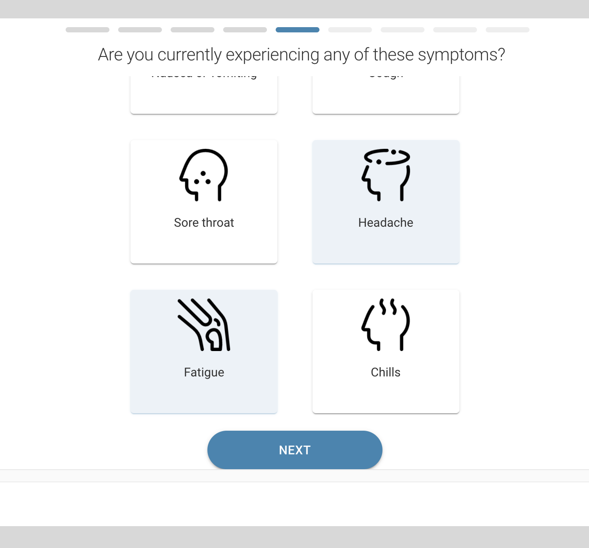
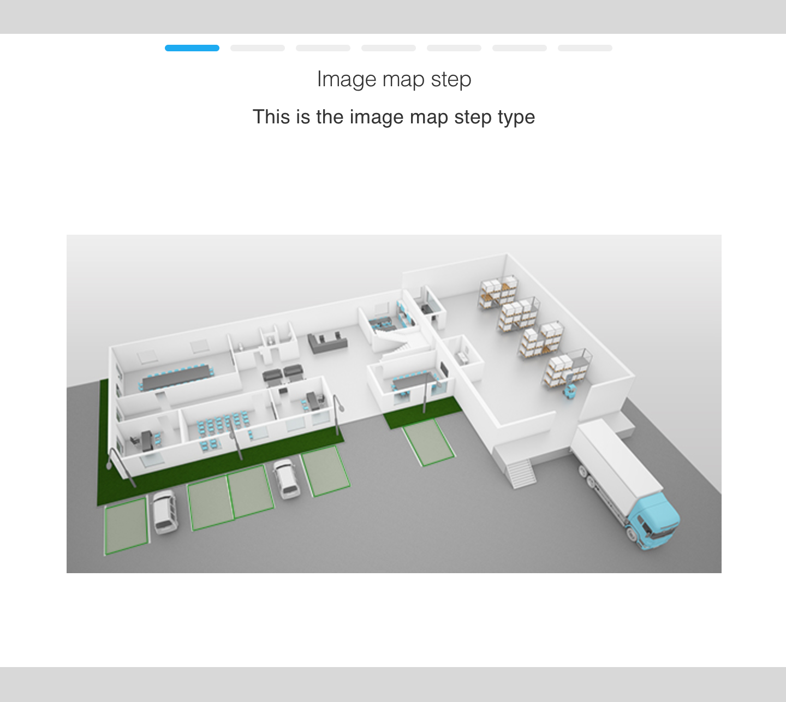

# Settings File
The settings file is a json file where we can set different parameters which we use in the widget. When cloning the git project under config/src folder you will find a settings.json file. This file is added to git, so we don’t modify this for now. In order to overwrite the settings file you need to create a settings.local.json file. The settings from the local file will overwrite everything that exists in the settings.json file.

<SchemaDefinition schemaRef="#/components/schemas/Settings" />

# Steps
Our widget supports different types of steps that you can add. Each step type has parameters that will be on each step as well as parameters that are specific to a certain step type. Below we will explain each step type:

## Info
This step is a presentational step only. It shows an information page where you can inform the user about different things. It is mostly used as an ending step if the user selects a sequence of different steps that lead to a point where you are not allowed to make an appointment.

<SchemaDefinition schemaRef="#/components/schemas/Info" />

## Tiles
This step can be used to show a grid of tiles from which the user can select. This step can be a multi tile select step or a single tile select step.

<SchemaDefinition schemaRef="#/components/schemas/Tiles" />

## Image Map
This step can be used to create an image map. It is used to create different click-able areas on an image. This will allow to create a more visual experience for different approaches (selecting a parking lot, a seat at a table, etc.). Note that this is a presentational step and it is not tied down to the availability. For the example of parking lots, if a lot is selected on a previous appointment, we can’t show it as taken.

<SchemaDefinition schemaRef="#/components/schemas/ImageMap" />

## Locations
This step can be used to show the locations that are defined in Setster as a list. This step is tied down to Setster API and it fetches information from Setster.

<SchemaDefinition schemaRef="#/components/schemas/Locations" />

## Locations Map
This step can be used to show the locations that are defined in Setster on a Google Map. This step is tied down to Setster API and it fetches information from Setster. When using this step, you have to also define the “googleMapOptions” parameter.

<SchemaDefinition schemaRef="#/components/schemas/LocationsMap" />

## Calendar
This step can be used to show the Setster booking calendar step. This step is tied down to Setster API and it fetches information from Setster. Also, this step is mandatory as this is the step that will lead you to the submit page.

<SchemaDefinition schemaRef="#/components/schemas/Calendar" />

## Services
This step can be used to show the services that are defined in Setster as a list. This step is tied down to Setster API and it fetches information from Setster.

<SchemaDefinition schemaRef="#/components/schemas/Services" />

## Staff
This step can be used to show the staff members that are defined in Setster as a list. This step is tied down to Setster API and it fetches information from Setster.

<SchemaDefinition schemaRef="#/components/schemas/Staff" />

## Filters
Filters are a way to filter the result fetched from Setster. They are available as a parameter on the following step types: ‘locations’, ‘locations-map’, ‘services’ and ‘staff’. Filters are being applied to the step inside which they are defined. We will start with a full example and describe what each parameter does and after that go over some other examples of use.

<SchemaDefinition schemaRef="#/components/schemas/Filters" />